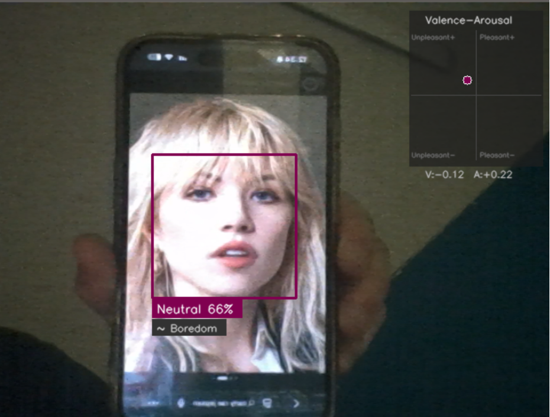

# Real-Time Facial Affect Analysis

Detects human faces in a live webcam feed and performs two types of affect analysis in parallel:
- **Categorical:** Classifies expressions into 7 discrete emotions
- **Dimensional:** Predicts continuous Valence (positive/negative) and Arousal (calm/excited) values
- **Fusion:** Cross-validates both outputs using Russell's Circumplex and Plutchik's Wheel of Emotions to infer intensity levels, compound emotions (dyads), and reliability



## Tech Stack

| Component | Tool |
|---|---|
| Face Detection | MediaPipe BlazeFace (short-range) |
| Emotion Classification | Mini Xception (trained on FER-2013) |
| Valence-Arousal Regression | MobileNetV2 (trained on AffectNet) |
| Affect Fusion | AffectFusionEngine (Russell + Plutchik) |
| Inference Runtime | TensorFlow Lite |
| Parallel Execution | Python `concurrent.futures.ThreadPoolExecutor` |
| Image Processing | OpenCV |

## Project Structure

```
emot_recog/
├── facecombined.py              # Combined emotion + VA + fusion (parallel inference)
├── affect_fusion.py             # AffectFusionEngine (Plutchik/Russell integration)
├── facemot.py                   # Standalone emotion classification
├── faceva.py                    # Standalone valence-arousal regression
├── convert_to_tflite.py         # HDF5 → TFLite (emotion model)
├── convert_va_to_tflite.py      # H5 weights → TFLite (VA model)
└── models/
    ├── emotionModel.tflite      # Emotion classifier (236 KB)
    ├── vaModel.tflite           # VA regressor (13.8 MB)
    ├── blaze_face_short_range.tflite  # MediaPipe face detection (225 KB)
    ├── emotionModel.hdf5        # Original emotion weights
    └── regressor_weights.h5     # Original VA weights
```

## How It Works

1. Captures frames from webcam via OpenCV (mirrored for selfie view)
2. MediaPipe BlazeFace detects faces → extracts face ROI per detection
3. Two models run **in parallel** per face via thread pool:
   - **Emotion:** Grayscale ROI → 64x64 → normalize to [-1, 1] → Mini Xception → 7-class softmax
   - **VA:** Color ROI → 224x224 RGB → normalize to [-1, 1] → MobileNetV2 → [valence, arousal]
4. **AffectFusionEngine** processes both outputs:
   - EMA-smooths V/A to reduce jitter
   - Russell sanity check (conflict score between categorical prediction and VA position)
   - Nearest-centroid mapping to Plutchik's 8 primary petals (using Mehrabian PAD coordinates)
   - Categorical disambiguation for ambiguous VA regions (e.g., Fear vs Anger)
   - Intensity inference (mild/basic/intense) from VA magnitude
   - Dyad detection from softmax distribution (e.g., Joy + Trust → Love)
5. Overlays: base emotion + confidence, Plutchik intensity word, dyad label, VA HUD grid

## Setup

```bash
pip install tensorflow opencv-python mediapipe numpy
```

## Usage

**Combined with fusion (recommended):**
```bash
cd emot_recog
python facecombined.py
```

**Emotion only:**
```bash
python facemot.py
```

**Valence-Arousal only:**
```bash
python faceva.py
```

All scripts support `-vw True` to save output to video. Press `Esc` to exit

## Models

| | Emotion | Valence-Arousal |
|---|---|---|
| **Architecture** | Mini Xception | MobileNetV2 + Dense(1024) + Dense(2) |
| **Dataset** | FER-2013 (35,887 images) | AffectNet (400K+ images) |
| **Input** | 64x64 grayscale | 224x224 RGB |
| **Output** | 7-class softmax | 2 floats: valence, arousal |
| **Params** | 58K | 3.6M |
| **TFLite size** | 236 KB | 13.8 MB |

### Emotion Classes

`Angry` · `Disgust` · `Fear` · `Happy` · `Sad` · `Surprise` · `Neutral`

### Valence-Arousal Scale

- **Valence** [-1, 1]: Negative ← 0 → Positive
- **Arousal** [-1, 1]: Calm ← 0 → Excited

## Affect Fusion

The `AffectFusionEngine` integrates two psychological frameworks:

**Russell's Circumplex Model** — validates that the categorical prediction (e.g., "Happy") is consistent with the VA coordinates. A conflict score flags unreliable predictions.

**Plutchik's Wheel of Emotions** — maps VA coordinates to 8 primary emotion petals using empirically validated centroids (Mehrabian PAD model). Each petal has 3 intensity levels:

| Petal | Mild | Basic | Intense |
|---|---|---|---|
| Joy | Serenity | Joy | Ecstasy |
| Trust | Acceptance | Trust | Admiration |
| Fear | Apprehension | Fear | Terror |
| Surprise | Distraction | Surprise | Amazement |
| Sadness | Pensiveness | Sadness | Grief |
| Disgust | Boredom | Disgust | Loathing |
| Anger | Annoyance | Anger | Rage |
| Anticipation | Interest | Anticipation | Vigilance |

**Dyads** (compound emotions) are inferred when the classifier's top two predictions are close in confidence:

| Primary Dyad | Components |
|---|---|
| Love | Joy + Trust |
| Awe | Fear + Surprise |
| Contempt | Disgust + Anger |
| Optimism | Anticipation + Joy |
| Remorse | Sadness + Disgust |

## License

See [LICENSE](face-classification/LICENSE).
